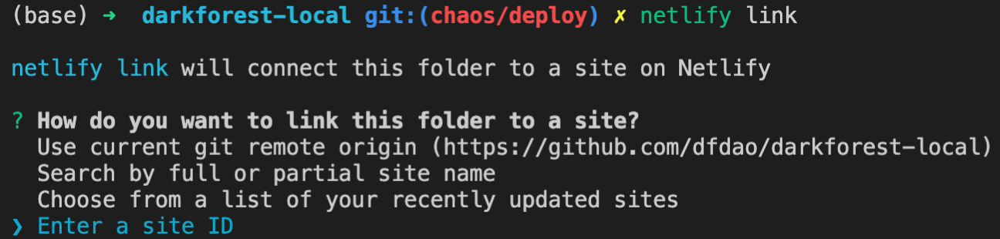

# darkforest-local

The Dark Forest client deploy process is set up for players to easily fork the client and connect to
the mainnet game, but that design decision currently makes it difficult to run a playable version
of the game locally. This repository provides a setup for running a local game with just a few
steps.

## Builder's Guide

For a full tutorial on using `darkforest-local` with multiple **quests**, check out the [Community Round Builder's Guide](builders_guide.md).

## How darkforest-local Works

This repo uses [submodules](.gitmodules) to pair the [Dark Forest Ethereum
backend](https://github.com/darkforest-eth/eth) with the [Dark Forest TypeScript
frontend](https://github.com/darkforest-eth/client) so you can launch a local game.

It also uses Yarn, a package manager and that allows for multiple [workspaces](https://classic.yarnpkg.com/lang/en/docs/workspaces) to exist within a project.

The workspaces allows each [submodule](.gitmodules) to have their own packages and configuration. 
Yarn places all of the packages for each submodule in the top level `node_modules/` folder.

## Requirements
* Install [Yarn](https://classic.yarnpkg.com/en/docs/install)
* Install `node >= 14` [nvm](https://github.com/nvm-sh/nvm)

### Fastest Method for Running a Local Game
1. Fork [darkforest-local](https://github.com/projectsophon/darkforest-local) to your Github repo.
2. `git clone https://github.com/<your_name>/darkforest-local.git`
3. `git submodule update --init --recursive --remote --merge`
4. `yarn`
5. `yarn start`

### Better Method for Running a Local Game
1. Fork [darkforest-local](https://github.com/projectsophon/darkforest-local) to your Github repo.
2. Fork [darkforest-eth/eth](https://github.com/darkforest-eth/eth) to your Github repo
3. Fork [darkforest-eth/client](https://github.com/darkforest-eth/client) to your Github repo.
4. Clone your darkforest-local repo: `git clone https://github.com/<your_name>/darkforest-local.git`
5. Update the `.gitmodules` file to point to your new forks of `eth` and `client.  
    ex: 
    * `url = https://github.com/darkforest-eth/eth` =>  
    `url = https://github.com/cha0sg0d/eth`
    * `url = https://github.com/darkforest-eth/client` =>  
    `url = https://github.com/cha0sg0d/client`
6. Fetch the code from the submodules
    * `git submodule update --init --recursive`   
7. Add new branches for developing:
    - The `darkforest-local` monorepo detaches the submodules from their current HEADs. If you want to save your changes (for example, if you're testing an new contract in `eth`), you'll need to make a new branch in these submodules.
    1. `cd eth`
        1. `git checkout -b <new_name>`
    2. `cd client`
        1. `git checkout -b <new_name>`
7. Install packages and dependencies
    * `yarn`
8. Start a game
    * `yarn start`

        If `yarn start` returns the error `ERR_OSSL_EVP_UNSUPPORTED`:  
        * *This error occurs when using Node v17+*
        * To fix, run `export NODE_OPTIONS=--openssl-legacy-provider` or switch to `14 <= node <= 16`
            
## Run a local game

- Running `yarn start`, will 1) start a local node, 2) deploy the contracts, and 3) run the local client in dev mode
- When finished, the process should pop up your browser to the game client at http://localhost:8081/

- Here are 3 private keys with 100 ETH each to use in the game:
    1. `0x044C7963E9A89D4F8B64AB23E02E97B2E00DD57FCB60F316AC69B77135003AEF`
    2. `0x523170AAE57904F24FFE1F61B7E4FF9E9A0CE7557987C2FC034EACB1C267B4AE`
    3. `0x67195c963ff445314e667112ab22f4a7404bad7f9746564eb409b9bb8c6aed32`


## Static deployment of Dark Forest (no webserver)

If you want to deploy the contracts (with whatever modifications you want) to mainnet, and client
code (with whatever modifications you want), you can follow these instructions. The reasons you
might want to do this could be one of:

- You want to run a community round of Dark Forest
- You want to run a multiplayer round with some friends
- etc.

Deploying to production is quite similar to deploying a local version of the game, but I'm going to
walk through the steps explicitly here.

### Step 1: deploy contracts

Unlike in development mode, in production mode you will need to create a `.env` file in both the
`client/` and `eth/` submodules. You can find the set of environment variables you will need to
populate those `.env` files with in their adjacent `.env.example` files.

> Danger! The `.env` files ARE in the respective `.gitignore`s of the aforementioned submodules,
> however you should also manually make sure that they don't end up checked into your repository.

To randomly generate a new deployer private key and mnemonic for `eth/.env`, run 
```bash
yarn workspace eth hardhat wallet:new
```
You should see something like this:


To deploy the contracts, you will need to run the following command:

```bash
yarn workspace eth hardhat:prod deploy
```

You should see something like this:


To find out more information about the `contracts` submodule, you can look here:
[https://github.com/darkforest-eth/eth](https://github.com/darkforest-eth/eth).

### Step 2: Deploy client website

To deploy the website interface, you may either self-host, or use the same infra that we use -
[Netlify](https://www.netlify.com/). This is a simple option, and free for up to some amount of
gigabytes of bandwidth per month, which has often been enough for us.

To use Netlify:

- Make a new [Netlify account](https://app.netlify.com/signup) using your Github profile.
- [Import](https://app.netlify.com/start) your Github client repo as a new Netlify site.
- Install the Netlify CLI
    - `npm install netlify-cli -g`
- Login to your account
    - `netlify login`
- Connect to your app
    - `netlify link`
    
    
    
- Choose *Enter a site ID*
    
    
    
- Input the id that you find by clicking on your new site on Netlify. In this example, the id is `jolly-hermann-3947ca`
- Now that your site is linked, you can deploy to Netlify from the CLI.
    - `yarn workspace client deploy:prod`
    - If successful, you will see something like this.
        
        
        
    - *Note: To do this, you will have to turn on automatic deploys for your site. This means that if you push an update to your main Git branch, Netlify will attempt to redeploy the site. This will fail, because the client relies on the most recent versions of the packages you have created, but Netlify will try to install the older versions from npm instead of locally.*
        
        
        
    - *If you inspect the Netlify deploy logs, you might see a bunch of failed builds. This is ok - your public URL will still contain the most recent successful deploy, which was the deploy you manually triggered from the CLI.*


### Step 3: Allow player addresses

The default implementation of Dark Forest ships with a [whitelist
contract](https://github.com/darkforest-eth/eth/blob/master/contracts/Whitelist.sol). When we
deployed the contracts in Step 1, amongst them was this whitelist contract. A 'static' deployment of
Dark Forest (no web server) isn't capable of submitting a whitelisting transaction on behalf of the
user (which lets a given burner address into the game and drips it a fraction of an xDAI).

This means that if you want to let players into your game, you must first collect their
addresses.

If you want to generate a burner wallet on the CLI for testing, follow the same steps from [Step 1](#step-1-deploy-contracts):

```bash
yarn workspace eth hardhat:dev wallet:new
```


Once you collect the addresses of the people you want to let into your world, you can register them
individually via the following command

```bash
yarn workspace eth hardhat:prod whitelist:register --address $BURNER_WALLET_ADDRESS
# where $BURNER_WALLET_ADDRESS is the network address of the player you want to allow to play in
# your deployment of the game.
```

If everything worked properly, you should be able to log in:


Then, once you've found a home planet, you should be able to enter the game!


### Step 4: Play your game

- Now go the URL given by Netlify → something like [https://jolly-hermann-3947ca.netlify.app/](https://jolly-hermann-3947ca.netlify.app/) and test out your game! Login with one of the private keys for the addresses that were whitelisted. Make some moves and test that everything works as expected.

## Update to latest Dark Forest code

If theres been new Dark Forest updates released and we haven't yet updated this repo yet, it is
possible you can get away with updating yourself by running `git submodule update --remote --merge`
and remember to run `yarn` again.

## For maintainers of the repo updating to latest Dark Forest code

- [Update the submodules](#update-to-latest-dark-forest-code).
- Replace the root `yarn.lock` with the `yarn.lock` from `eth/` or `client/`
- Run `yarn`.
- Finally add all changes, commit, and PR.