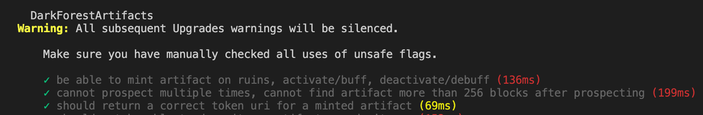
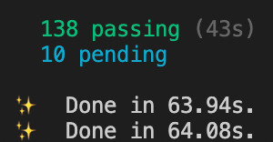
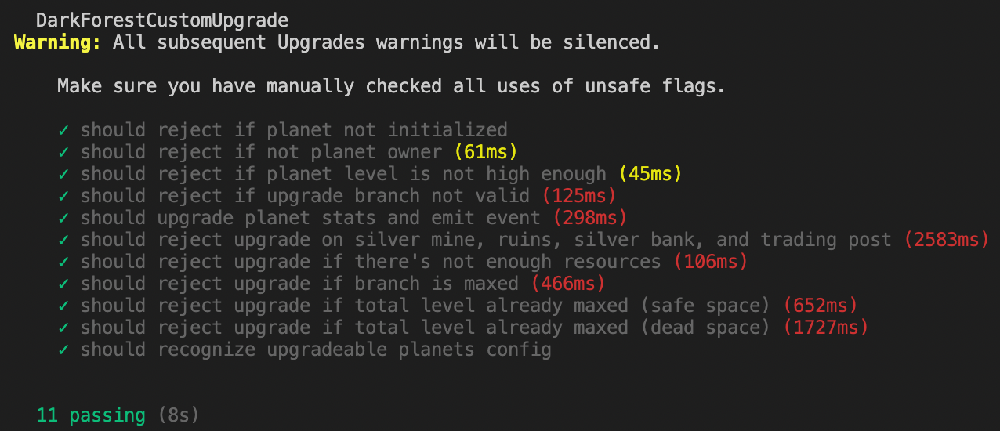
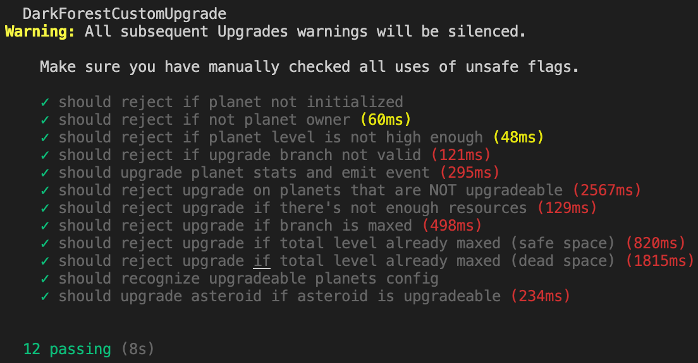

# Community Round Builder’s Guide

# Intro

- This guide will teach Dark Forest enthusiasts how to build and deploy their own rounds.
- It will also provide a high-level overview of the Dark Forest blockchain application. If are new to the Dark Forest codebase, please scan the [dapp breakdown document](dapp.md) first.

## Why should you run a community round?

- You can play Dark Forest whenever you want.
- You can customize the game with your own reward system, user interface, rulesets, and/or constraints.
- It’s super fun.

# Guide Structure

## Main Quests

0. [Download the correct code and install dependencies](#quest-0-installation-and-setup)
1. [Deploy a local game](#quest-1-local-game)
2. [Deploy a local game with a unique configuration via `darkforest.toml`](#quest-2-local-game-with-custom-configuration)
3. [Deploy a local game with a modified client and contracts](#quest-3-local-game-with-custom-client-and-contracts)
4. [Publish your local game to production on xDai and Netlify](#quest-4-deploy-contracts-and-client-to-production)

## Side Quests

1. [Deploy the subgraph](#side-quest-1-deploying-the-subgraph)
2. [Auto whitelisting with no server](#side-quest-2-auto-whitelisting-with-no-server)
3. [Publishing packages for your new contracts](#side-quest-3-publishing-your-new-contracts-as-an-npm-package)

## Knowledge Prerequisites

- How to [clone](https://docs.github.com/en/repositories/creating-and-managing-repositories/cloning-a-repository) git repositories.
- Good git [practices](#appendix-1-using-git-effectively)
- For Main Quest 3: a small amount of Solidity and TypeScript knowledge.

# Quest 0: Installation and Setup

1. Install [git](https://git-scm.com/downloads) to your local machine if you don’t have it already.
2. Make a GitHub [account](https://github.com/).
3. Clone the repo and install submodules and dependencies: 
    1. If you’re here to experiment with a local game and learn about the codebase, follow the [Quickstart for running a local game](README.md#quickstart-for-running-a-local-game) instructions.
    2. If you’re here to deploy a community round to production, follow the [If you plan to make changes to darkforest-local](README.md#if-you-plan-to-make-changes-to-darkforest-local) instructions.
    3. Don’t run `yarn start` just yet - we will practice testing the smart contracts before running a local game in Quest 1.

# Quest 1: Local Game

- We are going to learn how run a local game of Dark Forest with no changes to the current configuration.

## 1.0 Run Hardhat tests

- Read a quick [overview](dapp.md#what-is-hardhat) of the Hardhat deployment environment.

- This is not strictly necessary, but a good sanity check to make sure that the current smart contracts are passing the existing tests:  
	`yarn workspace eth test`
	
- You should see output like this:
    
    
    
    
    
- If everything looks good, the Solidity backend is ready to go.


## 1.1 Run a local game

- This is another sanity check to make sure the client and game have no obvious bugs.
- Run `yarn start`
    - You should have already run `yarn` in Step 0.3. Run `yarn` if you didn't already.
- In the game, test out the play. If you have any problems, check out the [Troubleshooting](#troubleshooting) section. Find a home planet, make a few moves, reveal a planet, etc. If everything looks good, you can be reasonably confident that everything will work in production.
- To stop the local Hardhat network and kill the client, type `CTRL C` (^C) in your terminal.

# Quest 2: Local game with custom configuration

- For this quest, you will configure the universe to be a race to the center with one objective: *Be the first person to capture the Level 9 Planet at coordinate (0,0).*

## 2.0 Understand `darkforest.toml`

- Now we are going to make some changes to the game via the settings file. This file is called `darkforest.toml` and lives in the [eth](https://github.com/darkforest-eth/eth/) repository.
- The `darkforest.toml` is useful because it allows you to configure a large number game parameters without writing a single line of code. Understanding what each parameter means is also a great way to get acquainted with the codebase.
- Read the explanation of each setting in this [gist](https://gist.github.com/cha0sg0d/2d4d9b95a5f90c1b0e285b601b850827).
  - *Note: Parameters that affect shrinking are not in the base codebase, so can't be used for this tutorial*.

## 2.1 Configure `darkforest.toml`

- Duplicate the existing the `darkforest.toml` file.
- Rename it `darkforest.localhost.toml`
  - *Note: The settings loader will [prefer](https://github.com/darkforest-eth/eth/blob/master/settings.ts#L260) a toml file that includes your network name over the one without.*
  - *If you want to deploy your .toml changes to production, put them in `darkforest.xdai.toml`.*

- Add the following to `darkforest.localhost.toml`:

```toml
# Add lvl9 admin planet at (0,0)
[[planets]]
  x = 0
  y = 0
  level = 9
  planetType = 0
  requireValidLocationId = false
  revealLocation = true
```

## 2.3 Run Hardhat tests

- Same as in Step 1.0

## 2.4 Run a local game

- Same as 1.2, but check to see that there is a level 9 planet at location (0,0) when you join the universe.
- The existing deploy script should automatically create the level 9 planet because it calls the Hardhat `createPlanets` task.

## 2.5 Play your game

- Same as 1.1, but now you’re in a custom universe that you designed!
- Without writing even one line of code, you’ve just made a custom mode of Dark Forest. Next, we are going to learn how to modify the game even further.

# Quest 3: Local game with custom client and contracts

- For this quest, you will create a Dark Forest game with the following custom rule change: All planets can be upgraded, not just planets of type PLANET.
	- If you are new to Dark Forest, there are 5 planet types: Planet, Asteroid, Foundry, Spacetime Rip, and Quasar. Currently, only the Planet type can be upgraded to improve its defense, range, or speed. 
- We will add a new setting, `UPGRADEABLE_PLANETS` that is an array of 5 booleans. If an element is true, the corresponding planet type can be upgraded. If an element is false, the corresponding planet type cannot be upgraded.
- Before you get started, review the [structure](dapp.md#client-overview) of the Dark Forest codebase.

## 3.0 Set up a new config variable

- We want future users to be able to control planet upgrades from the `darkforest.toml` file. This allows for easy customization of the game for non-technical users.

### 3.0.1 Add a new `UPGRADEABLE_PLANETS` variable to the contracts

- With these edits, we are simply adding a new constant to the codebase that will be set before the contracts are deployed in the `darkforest.localhost.toml`. To have a variable reflected across the smart contracts requires making changes in a few places:
- In `darkforest.localhost.toml`:
    
    ```toml
    # Corresponds to [Planet, Asteroid, Foundry, Rip, Quasar]
    UPGRADEABLE_PLANETS = [true, true, false, false, false]
    ```
    
- In `contracts/DarkForestTypes.sol`:
    
    ```solidity
    struct GameConstants {
    	...
    	bool[5] UPGRADEABLE_PLANETS;
    	...
    }
    ```
    
    ```solidity
    struct DfInitArgs {
    	...
    	bool[5] UPGRADEABLE_PLANETS;
    	...
    }
    ```
    
- In `contracts/DarkForestCore.sol`:
    
    ```solidity
    // ~ line 92
    s.gameConstants = DarkForestTypes.GameConstants({
    		...
    		UPGRADEABLE_PLANETS: initArgs.UPGRADEABLE_PLANETS
    })
    
    ```
    
- In `settings.ts`:
    
    ```typescript
    // ~ line 151
      UPGRADEABLE_PLANETS: yup.array(yup.boolean()).length(5).default([true,false,false,false,false])
    ```
    
- Run `yarn hardhat workspace eth compile` to make sure that the contract compiles successfully.
  - *See contract too big warning in [Troubleshooting](#troubleshooting) if needed.*

## 3.1 Write a Hardhat test to confirm existence of new config

### 3.1.1 Add a new fixture for testing an upgradeable planets universe

- *Quickly Learn about [fixtures](https://ethereum-waffle.readthedocs.io/en/latest/fixtures.html).*
- Add to `eth/test/utils/WorldConstants.ts`:
    
    ```typescript
    export const customUpgradeInitializers = {
      ...initializers,
      UPGRADEABLE_PLANETS: [true, true, false, false, false]
    // We're adding the ability to upgrade asteroids!
    }
    ```
    
- Add to `eth/test/utils/TestWorld.ts`:
    
    ```typescript
    import { customUpgradeInitializers } from './WorldConstants';
    
    export function customUpgradeWorldFixture(): Promise<World> {
      return initializeWorld({
        initializers: customUpgradeInitializers,
        enableWhitelist: false,
      });
    }
    ```

### 3.1.2 Make a new file for testing

- Duplicate `DFUpgrade.test.ts` and name it `DFCustomUpgrade.test.ts`
- In `eth/test/DFCustomUpgrade.test.ts`:
    - Rename the test
    
    ```diff
    - describe('DarkForestUpgrade', function () {
    + describe('DarkForestCustomUpgrade', function () {
    ```
    

### 3.1.3 Switch the world fixture in the new test file

- In `eth/test/DFCustomUpgrade.test.ts`:
    
    ```diff
     import {..., customUpgradeWorldFixture } from './utils/TestWorld'

     beforeEach('load fixture', async function () {
    -    world = await fixtureLoader(defaultWorldFixture)
    +    world = await fixtureLoader(customUpgradeWorldFixture);
     });
    ```
    

### 3.2.3 Write a test to confirm a new config appears

- In `eth/test/DFCustomUpgrade.test.ts`:
    
    ```typescript
    ... // near line 234
    it('should recognize upgradeable planets config', async function (){
        const gameConstants = await world.contracts.core.gameConstants()
        const expected = [true,true,false,false,false];
        expect(gameConstants.UPGRADEABLE_PLANETS).to.eql(expected);
    });
    
    ```
    
- *Note: To learn more about .eql vs .equal and Chai, check out this [doc](https://ethereum-waffle.readthedocs.io/en/latest/matchers.html).*

### 3.2.4 Run that test

- `yarn workspace eth hardhat test test/DFCustomUpgrade.test.ts`
    
    
    
- A successful result should look like this ^.

## 3.2 Add the business logic to the `DarkForestPlanet.sol`

- Now that we have a basic test and a new config variable, we actually are going to change the rules of Dark Forest!
- In `contracts/DarkForestPlanet.sol`

```diff
// ~line 323
 require(
-          planet.planetType == DarkForestTypes.PlanetType.PLANET,
-             "Can only upgrade regular planets"
+          s().gameConstants.UPGRADEABLE_PLANETS[uint256(planet.planetType)],
+             "Can only upgrade allowed planet types"
 );
```

- We just changed which planets can be upgraded!

### 3.3 Write new Hardhat tests for the new logic

### 3.3.1 Modify the `should reject upgrade on silver mine, ...` test.

- This test should now only reject upgrade on planets that are *marked false* in the `UPGRADEABLE_PLANETS` settings.
- When you are done, rename the test `should reject upgrade on planets that are NOT upgradeable`.

- Try this on your own before peeking!
<details>
 <summary>Solution</summary>

  ```typescript
    it('should reject upgrade on planets that are NOT upgradeable', async function () {
        await world.user1Core.initializePlayer(...makeInitArgs(SPAWN_PLANET_1));

        // conquer the special planets
        await conquerUnownedPlanet(world, world.user1Core, SPAWN_PLANET_1, LVL1_ASTEROID_2);
        await conquerUnownedPlanet(world, world.user1Core, SPAWN_PLANET_1, LVL3_SPACETIME_1);
        await conquerUnownedPlanet(world, world.user1Core, SPAWN_PLANET_1, ARTIFACT_PLANET_1);
        await conquerUnownedPlanet(world, world.user1Core, SPAWN_PLANET_1, LVL1_QUASAR);

        // fill up the special planets with silver
        await feedSilverToCap(world, world.user1Core, LVL1_ASTEROID_2, LVL3_SPACETIME_1);
        await feedSilverToCap(world, world.user1Core, LVL1_ASTEROID_2, ARTIFACT_PLANET_1);
        await feedSilverToCap(world, world.user1Core, LVL1_ASTEROID_2, LVL1_QUASAR);
        await increaseBlockchainTime(); // fills up LVL1_ASTEROID_2

        const UPGRADEABLE_PLANETS = (await world.contracts.core.gameConstants()).UPGRADEABLE_PLANETS;

        enum PlanetType {PLANET, ASTEROID, FOUNDRY, RIP, QUASAR};

        // Only expect revert on planets that are NOT upgradeable

        if(!UPGRADEABLE_PLANETS[PlanetType.PLANET]) {
          console.log("ERROR: PLANET type must be upgradeable");
        }

        if(!UPGRADEABLE_PLANETS[PlanetType.ASTEROID]) {
          await expect(world.user1Core.upgradePlanet(LVL1_ASTEROID_2.id, 0)).to.be.revertedWith(
            'Can only upgrade allowed planet types'
          );
        }

        if(!UPGRADEABLE_PLANETS[PlanetType.FOUNDRY]) {
          await expect(world.user1Core.upgradePlanet(ARTIFACT_PLANET_1.id, 0)).to.be.revertedWith(
            'Can only upgrade allowed planet types'
          );
        }

        if(!UPGRADEABLE_PLANETS[PlanetType.RIP]) {
          await expect(world.user1Core.upgradePlanet(LVL3_SPACETIME_1.id, 0)).to.be.revertedWith(
            'Can only upgrade allowed planet types'
          );
        }

        if(!UPGRADEABLE_PLANETS[PlanetType.QUASAR]) {
          await expect(world.user1Core.upgradePlanet(LVL1_QUASAR.id, 0)).to.be.revertedWith(
            'Can only upgrade allowed planet types'
          );
        }
      });
  ```
</details>
    

### 3.3.2 Create a new test to confirm asteroid upgrades are successful

- Name this test: `should upgrade asteroid if asteroid is upgradeable`

- If you carefully examine the `should upgrade planet stats and emit event` test in `DFCustomUpgrade.test.ts`, you should be able to infer how to test the upgrade for the `LVL1_ASTEROID_2`.
- Try this on your own before peeking!
<details>
  <summary>Solution</summary>

  ```typescript
    it('should upgrade asteroid if asteroid is upgradeable', async function (){
        const ASTEROID = 1;
        const gameConstants = await world.contracts.core.gameConstants()
        expect(gameConstants.UPGRADEABLE_PLANETS[ASTEROID]).to.be.true;

        const upgradeablePlanetId = LVL1_PLANET_NEBULA.id;
        const silverMinePlanetId = LVL1_ASTEROID_2.id;

        await world.user1Core.initializePlayer(...makeInitArgs(SPAWN_PLANET_1));

        // conquer silver mine and upgradeable planet
        await conquerUnownedPlanet(world, world.user1Core, SPAWN_PLANET_1, LVL1_PLANET_NEBULA);
        await conquerUnownedPlanet(world, world.user1Core, SPAWN_PLANET_1, LVL1_ASTEROID_2);

        await increaseBlockchainTime();

        await world.user1Core.refreshPlanet(silverMinePlanetId);

        const planetBeforeUpgrade = await world.contracts.core.planets(silverMinePlanetId);

        const silverCap = planetBeforeUpgrade.silverCap.toNumber();
        const initialSilver = planetBeforeUpgrade.silver.toNumber();
        const initialPopulationCap = planetBeforeUpgrade.populationCap;
        const initialPopulationGrowth = planetBeforeUpgrade.populationGrowth;

        await expect(world.user1Core.upgradePlanet(silverMinePlanetId, 0))
          .to.emit(world.contracts.core, 'PlanetUpgraded')
          .withArgs(world.user1.address, silverMinePlanetId, BN.from(0), BN.from(1));

        const planetAfterUpgrade = await world.contracts.core.planets(silverMinePlanetId);
        const newPopulationCap = planetAfterUpgrade.populationCap;
        const newPopulationGrowth = planetAfterUpgrade.populationGrowth;
        const newSilver = planetAfterUpgrade.silver.toNumber();

        expect(newSilver).to.equal(initialSilver - 0.2 * silverCap);
        expect(initialPopulationCap).to.be.below(newPopulationCap);
        expect(initialPopulationGrowth).to.be.below(newPopulationGrowth);
      });
  ```
</details>

## 3.4 Run the new Hardhat test

- `yarn workspace eth hardhat test test/DFCustomUpgrade.test.ts`
- You should see this output
    
    
    

## 3.5 Run all Hardhat tests

- `yarn workspace eth test`
- You will see an error in `DFUpgrade.test.ts`:
    
    > AssertionError: Expected transaction to be reverted with Can only upgrade regular planets, but other exception was thrown: Error: VM Exception while processing transaction: reverted with reason string 'Can only upgrade allowed planet types’
    > 
    - How would you fix this?
        - (Hint: see the Solution to 3.3.1)
- Fix this error and run `yarn workspace eth test` again and all test should pass.

The upgrade logic is now working in the tests, but we need to make these changes accessible to players using the game client as well.

## 3.6 Add `UPGRADEABLE_PLANETS` config to the client

- This allows us to reference the value of `UPGRADEABLE_PLANETS` anywhere in the client.

### 3.6.1 Add `UPGRADEABLE_PLANETS` type

- The Dark Forest client is a TypeScript project. That means that for every new variable we add, (like `UPGRADEABLE_PLANETS`), we need to add its type as well.
- In `client/src/_types/darkforest/api/ContractsAPITypes.ts:`
    
    ```diff
    export interface ContractConstants {
       ...
    +  UPGRADEABLE_PLANETS: boolean[];
    }
    ```
    

### 3.6.2 Add `UPGRADEABLE_PLANETS` value

- In `client/src/Backend/GameLogic/ContractsAPI.ts`
    
    ```typescript
    // ~ Line 800
    {
    ...
    UPGRADEABLE_PLANETS
    } = await this.makeCall(this.coreContract.gameConstants);
    
    // ~ Line 880
    
    const constants: ContractConstants = {
    ...
    UPGRADEABLE_PLANETS
    }
    ```
    

## 3.7 Show user which planets are upgradeable

- In `client/src/Frontend/Panes/UpgradeDetailsPane.ts`:
    - Try to change this logic yourself to allow only the planets marked as true in `UPGRADEABLE_PLANETS` variable to be upgraded in the client.
    - Hint: This is very similar to the change we made to `DarkForestPlanet.sol` but in TypeScript.
    - Also, to get access to the `UPGRADEABLE_PLANETS` value, we need to access the GameManager object. The React [Frontend](https://github.com/darkforest-eth/client/tree/master/src/Frontend) doesn’t have direct access to the GameManager, but it does have access to the GameUiManager, which can fetch the GameManager.
    - So, getting the `UPGRADEABLE_PLANETS` value looks like this:
        
        ```jsx
        const UPGRADEABLE_PLANETS = uiManager.getGameManager().getContractConstants().UPGRADEABLE_PLANETS;
        ```
        
<details>
  <summary>Solution</summary>
        
  ```typescript
  // ~ Line 88
  const UPGRADEABLE_PLANETS = uiManager.getGameManager().getContractConstants().UPGRADEABLE_PLANETS;

    if (planet && account) {
      if (planet.owner !== account) {
      } else if (!UPGRADEABLE_PLANETS[planet.planetType] || planet.silverCap === 0) {
        content = (
          <CenterBackgroundSubtext width={'100%'} height='100px'>
            This Planet <br /> is not Upgradeable
          </CenterBackgroundSubtext>
        );
      }
  ```
</details>
        

## 3.8 Run a local game

- `yarn` to compile the client side changes
- `yarn start` to launch the game. (Same as step 1.1)
    - *Note: For test purposes, you can set `DISABLE_ZK_CHECKS` to true for the local game.*
- See if you can upgrade an asteroid field!
    - [It should look something like this](https://twitter.com/cha0sg0d_/status/1484620387866447873)

A complete solution to Quest 3 can be found on the tutorial branch of [cha0sg0d/eth](https://github.com/cha0sg0d/eth/tree/tutorial) and [cha0sg0d/client](https://github.com/cha0sg0d/client/tree/tutorial).

# Quest 4: Deploy contracts and client to production

Follow the steps in the [README](README.md#static-deployment-of-dark-forest-no-webserver) to deploy the contracts and client.

If your round includes custom planets, run the following command after deploying DarkForestCore:

### 4.1 Add custom planet (optional).

- `yarn workspace eth hardhat:prod game:createPlanets`
    - This functionality is built-in to the local deploy process, but needs to happen manually for deploying to production.


## Side Quest 1: Deploying the subgraph

- What is [The Graph](https://thegraph.com/) and why is it useful?
    - [The Graph](https://thegraph.com/) is an indexing protocol for querying networks like Ethereum and IPFS. Anyone can build and publish open APIs, called subgraphs, making data easily accessible.
    - The graph enables more complex queries like who owned this planet at time *t* and has a much faster performance than a vanilla JSON-RPC request.
- [Jacob Rosenthal](https://twitter.com/jacobrosenthal) has created a DF subgraph that can be deployed via just a few commands. Follow the instructions [here](https://github.com/darkforest-eth/eth/tree/master/subgraph) to deploy the subgraph.
    - *Note: If you’re on a Mac M1, make sure you have the [correct Docker version](https://docs.docker.com/desktop/mac/apple-silicon/).*
- If you are changing a fundamental data structure of the subgraph, you will need to update the schema and mappings. See [here](https://github.com/cha0sg0d/eth/commit/1b382624c986ed2b045b8465bde2df543dc5d3f0) for an example edit.

## Side Quest 2: Auto Whitelisting with no server

- Get a csv file of all the addresses you want to add to the game.
- Run the following command (`hardhat:prod` for production or `hardhat:dev` for local network)
  - Run: `yarn workspace eth hardhat:prod whitelist:registerAddress --address < cat address.csv`

  - This will generate a whitelist key for each address and add them to the game.

- You can automate this process (if more people are joining your game) with a simple Hardhat script

- Here is a sample [auto whitelist script](https://github.com/cha0sg0d/eth/blob/community/scripts/whitelist.js) that will give you a place to start.


## Side Quest 3: Publishing your new contracts as an npm package

- Work in progress...


## Troubleshooting

- If you see any ZK checks fail, like `failed init proof check`, you need to recompile the circuits with the following command:
    - `yarn workspace eth circom:dev`
    - Wait ~5 minutes for the circuits to recompile. This will result in a new `Verifier.sol` file.
- If you see the following warning
    
    > Warning: Contract code size is 24622 bytes and exceeds 24576 bytes (a limit introduced in Spurious Dragon). This contract may not be deployable on mainnet. Consider enabling the optimizer (with a low "runs" value!), turning off revert strings, or using libraries.
    > 
    - You need to reduce the contract size. Try commenting out changeAdmin or buyHat functions in DarkForestCore. Note that if you do, you will also have to comment out or delete the tests that use these functions. (`eth/test/DFHat.test`)

## Appendix 1: Using Git effectively

- For setting up your environment initially, see the [If you plan to make changes to darkforest-local](README.md#if-you-plan-to-make-changes-to-darkforest-local) steps.
- Each time you want to add a new feature, make a new branch on that specific repository.
    - `git checkout -b <new_feature>`
- When the feature is ready to go, merge it with your main branch and delete the feature branch.
    - `git checkout main`
    - `git merge new-feature`
    - `git branch -d new-feature`
- When making changes to the codebase, describe each change you make via `git add` and `git commit -m <your_messsage>`
- It is crucial that each edit is understandable to someone who did not write this code.
- See [cha0sg0d's](https://github.com/cha0sg0d) `darkforest/eth` [repo](https://github.com/cha0sg0d/eth/commits/community) for an example of documenting each commit.

